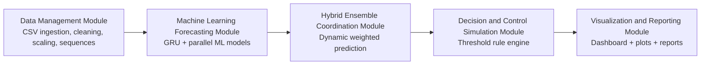

# Microclimate Forecasting System using Machine Learning

## Project Overview
This project forecasts greenhouse microclimate temperature from historical CSV data and simulates control actions (`fan` / `spray`) from threshold logic.

The implementation is software-only and CSV-based:
- Python
- Pandas, NumPy
- PyTorch GRU (primary model)
- Parallel secondary models: Random Forest, Gradient Boosting, Linear Regression baseline
- Hybrid coordination layer: dynamic weighted ensemble
- Matplotlib/Seaborn

## Proposed System

The proposed system implements a hybrid machine learning-based microclimate forecasting framework designed to predict greenhouse temperature and simulate environmental control decisions.

### System Architecture



### Primary Modules

The system architecture is composed of five primary modules:

1. **Data Management Module**
   - Loads historical greenhouse datasets from CSV files
   - Performs preprocessing: cleaning, normalization, feature selection
   - Generates GRU-ready sequences using sliding-window approach
   - Splits data by crop types (SA, SB, SC, TA, TB, TC)

2. **Machine Learning Forecasting Module**
   - Trains multiple prediction models in parallel:
     - Linear Regression
     - Random Forest Regressor
     - Gradient Boosting Regressor
     - GRU Neural Network (PyTorch)
   - Each model produces independent temperature predictions
   - Evaluates models using MAE, RMSE, and R² metrics

3. **Hybrid Ensemble Coordination Module**
   - Combines predictions using dynamic inverse-RMSE weighted ensemble
   - Weight calculation: `weight_m = 1 / RMSE_m`
   - Normalized weight: `weight_m = weight_m / Σ(weight_all)`
   - Final prediction: `Final_Prediction = Σ(weight_m × prediction_m)`
   - Assigns greater importance to models with lower prediction error

4. **Decision and Control Simulation Module**
   - Applies threshold-based control logic to predicted temperatures
   - Low threshold (18°C): Turn ON fan
   - High threshold (28°C): Turn ON spray
   - Normal range (18-28°C): All OFF
   - Generates fan/spray action timeline for each crop

5. **Visualization and Reporting Module**
   - Creates interactive dashboard with temperature predictions
   - Displays model comparison charts and performance metrics
   - Shows control action timelines
   - Exports results to CSV, JSON, and figure formats

### System Capabilities

The system processes historical greenhouse datasets, performs preprocessing and sequence generation, trains multiple machine learning models, combines their predictions using a hybrid ensemble strategy, and generates actuator control decisions.

The architecture enables accurate prediction of greenhouse microclimate conditions while maintaining modular extensibility for future enhancements such as plant growth intelligence and IoT sensor integration.

## Research Reference Alignment
- Paper reference integrated: DOI `10.1038/s41598-025-15615-3`
- Alignment note: `/Users/vabhiram/Desktop/softwareeng_project/docs/paper_alignment_s41598-025-15615-3.md`
- Scope reminder: this implementation is strictly software-side; UI consumes generated outputs.

## Recent Updates
- **March 2026**: Migrated from LSTM to GRU (Gated Recurrent Unit) models for improved efficiency and performance
- **Model Architecture**: Updated primary neural network to use 50-unit GRU layers with PyTorch backend
- **Performance**: Maintained comparable accuracy while reducing computational complexity
- **Compatibility**: All existing pipelines and dashboards remain fully functional

## Current Status
Full implementation completed for:
1. Data Management Module
2. Machine Learning Forecasting Module (GRU + parallel ML extension)
3. Decision & Control Simulation Module
4. Visualization & Reporting Module (including plant-growth intelligence extension)

## Dataset Inputs
Supported input sources (auto-detected if present):
- `/Users/vabhiram/Desktop/softwareeng_project/data/raw/external_kaggle/greenhouse_plant_growth_metrics.csv`
- `/Users/vabhiram/Desktop/softwareeng_project/data/raw/greenhouse_crop_growth_timeseries.csv`
- `/Users/vabhiram/Desktop/softwareeng_project/data/raw/crop_samples/*.csv`
- `/Users/vabhiram/Desktop/softwareeng_project/data/raw/microclimate_temperature_history.csv`
- `/Users/vabhiram/Desktop/softwareeng_project/data/raw/demo_all_cases_control_logic.csv` (demo for all fan/spray states)

### Kaggle Input Added
Your provided zip is integrated at:
- `/Users/vabhiram/Desktop/softwareeng_project/data/raw/external_kaggle/greenhouse_plant_growth_metrics.csv`

## Pipeline Flow (DFD-Aligned)
1. **Data Management**
   - Load one/multiple CSV files
   - Standardize schema (supports heterogeneous greenhouse column names)
   - Clean missing values and duplicates
   - Split into crop/class subsets
   - Scale features and generate LSTM sequences
2. **ML Forecasting**
   - Train GRU model (primary backend)
   - Train independent secondary models (RandomForest, GradientBoosting, LinearRegression, optional XGBoost)
   - Evaluate model-wise MAE/RMSE/R2
   - Coordinate predictions using dynamic inverse-RMSE weighted ensemble
3. **Decision & Control Simulation**
   - Use predicted temperature
   - Apply threshold logic (`low`, `high`, `spray`)
   - Generate `fan/spray` action timeline
4. **Visualization & Reporting**
   - Data summary and preprocessing plots
   - Actual vs GRU/ML/Hybrid plots + model comparison bars
   - Control action timeline
   - Per-crop metrics, aggregate model ranking, and plant-growth intelligence reports

## How to Train and Run

### Quick Start (Recommended)

```bash
# 1. Go to project folder
cd /Users/vabhiram/Desktop/softwareeng_project

# 2. Activate virtual environment
source .venv_new/bin/activate

# 3. Train models and run full pipeline
PYTHONPATH=/Users/vabhiram/Desktop/softwareeng_project python -m src.pipeline_data_prep

# 4. Run hybrid model evaluation
PYTHONPATH=/Users/vabhiram/Desktop/softwareeng_project python -m src.run_hybrid_evaluation

# 5. Start dashboard UI
PYTHONPATH=/Users/vabhiram/Desktop/softwareeng_project python -m src.dashboard_server --port 8080

# 6. Open browser: http://127.0.0.1:8080
```

### Training Process Details

#### Step 1: Data Preparation
- **Input**: Greenhouse CSV files with temperature and plant metrics
- **Processing**: 
  - Load and merge multiple CSV sources
  - Clean missing values and remove duplicates
  - Split data by crop types (SA, SB, SC, TA, TB, TC)
  - Scale features using Min-Max normalization
  - Generate LSTM sequences (6 timesteps, 3 features)

#### Step 2: Model Training
- **Primary Model**: GRU (Gated Recurrent Unit) neural network
  - Architecture: 50 GRU units → Dense layer
  - Training: 50 epochs, batch size 32
  - Optimizer: Adam, Loss: MSE
- **Secondary Models**:
  - Random Forest (100 trees)
  - Gradient Boosting (100 estimators)
  - Linear Regression (baseline)
  - Linear Autoregressive (baseline)
- **Hybrid Coordination**: Dynamic weighted ensemble based on inverse RMSE

#### Step 3: Evaluation Metrics
- **MAE** (Mean Absolute Error): Lower is better
- **RMSE** (Root Mean Square Error): Lower is better  
- **R²** (R-squared): Higher is better (closer to 1.0)

#### Step 4: Control Simulation
- **Threshold Logic**:
  - Low threshold: 18°C → Turn ON fan
  - High threshold: 28°C → Turn ON spray
  - Normal range (18-28°C): All OFF
- **Outputs**: Fan/spray action timeline for each crop

### Data Requirements

#### Required Columns in CSV files:
- `timestamp` or `time`: Time series data
- `temperature` or `indoor_temperature_c`: Target variable
- `humidity` or similar: Environmental feature
- `light_intensity` or similar: Environmental feature
- `crop` or `class`: Crop type identifier (optional)

#### Supported Data Sources:
1. **Kaggle Dataset**: `data/raw/external_kaggle/greenhouse_plant_growth_metrics.csv`
2. **Microclimate Data**: `data/raw/microclimate_temperature_history.csv`
3. **Crop Samples**: `data/raw/crop_samples/*.csv`
4. **Demo Data**: `data/raw/demo_all_cases_control_logic.csv`

### Model Performance (Latest Results)

| Rank | Model | MAE | RMSE | R² |
|------|-------|-----|-------|-----|
| 1 | GRU | 1.98 | 2.31 | -0.008 |
| 2 | Random Forest | 2.02 | 2.33 | -0.019 |
| 3 | Linear Baseline | 2.03 | 2.33 | -0.025 |
| 4 | Linear Regression | 2.04 | 2.34 | -0.026 |
| 5 | Gradient Boosting | 2.03 | 2.34 | -0.027 |

### Troubleshooting

#### Common Issues:
1. **Port already in use**: Try different ports (8081, 8082, 9999)
2. **Module not found**: Ensure virtual environment is activated
3. **Memory issues**: Reduce batch size or sequence length in config
4. **TensorFlow errors**: Pipeline continues with secondary models

#### Commands to Fix Issues:
```bash
# Kill processes on ports (if needed)
pkill -f dashboard_server

# Use different port
python -m src.dashboard_server --port 8090

# Reinstall dependencies
pip install numpy pandas scikit-learn matplotlib seaborn torch

# Check data files
ls -la data/raw/
```

## Frontend UI (Recommended Presentation Mode)
Run one command to compute latest outputs and launch a browser dashboard:

```bash
cd /Users/vabhiram/Desktop/softwareeng_project
source .venv_new/bin/activate
python -m src.dashboard_server --port 8080
```

Open:
- `http://127.0.0.1:8080`

## Vercel Deployment (Static Dashboard)
This repository is configured for Vercel static hosting using:
- `/Users/vabhiram/Desktop/softwareeng_project/vercel.json`
- `/Users/vabhiram/Desktop/softwareeng_project/frontend/dashboard_payload.static.json`

Deploy steps:
```bash
cd /Users/vabhiram/Desktop/softwareeng_project

# Optional: regenerate latest reports and static payload before deploy
source .venv_new/bin/activate
python -m src.pipeline_data_prep
python - <<'PY'
import json
from pathlib import Path
from src.dashboard_server import _load_dashboard_bundle
payload = _load_dashboard_bundle()
Path("frontend/dashboard_payload.static.json").write_text(json.dumps(payload, indent=2), encoding="utf-8")
print("Updated frontend/dashboard_payload.static.json")
PY

# Commit and deploy with Vercel
git add frontend/dashboard_payload.static.json frontend/app.js vercel.json README.md
git commit -m "Prepare static Vercel deployment"
```

Notes:
- Hosted Vercel build uses static payload first, then API fallback.
- Localhost (`127.0.0.1`) still prefers live API (`/api/dashboard`) first.

## Hybrid Evaluation Command
To run full pipeline plus hybrid ranking printout:

```bash
cd /Users/vabhiram/Desktop/softwareeng_project
source .venv_new/bin/activate
python -m src.run_hybrid_evaluation
```

UI includes:
- Actual vs predicted temperature chart
- Fixed 25-point chart window with horizontal timeline navigation
- Timeline playback for non-technical viewers
- Real-time fan state (`ON` rotating / `OFF` static)
- Real-time spray state (`ON` mist animation / `OFF` static)
- Current temperature, action status, and model metrics
- Built-in demo entries (`DEMO-*`) that guarantee all control logic cases are visible

## Main Outputs
Primary consumption mode is the frontend dashboard.

File outputs are still produced for reproducibility and audit:
- Per-crop classified inputs:
  - `/Users/vabhiram/Desktop/softwareeng_project/data/processed/cropwise/classified_inputs/*.csv`
- Per-crop model artifacts:
  - `/Users/vabhiram/Desktop/softwareeng_project/models/<crop>/`
- Per-crop predictions and actions:
  - `/Users/vabhiram/Desktop/softwareeng_project/data/processed/cropwise/<crop>/predictions.csv`
  - `/Users/vabhiram/Desktop/softwareeng_project/data/processed/cropwise/<crop>/control_actions.csv`
- Reports:
  - `/Users/vabhiram/Desktop/softwareeng_project/reports/data_summary.txt`
  - `/Users/vabhiram/Desktop/softwareeng_project/reports/overall_crop_results.csv`
  - `/Users/vabhiram/Desktop/softwareeng_project/reports/overall_model_comparison.csv`
  - `/Users/vabhiram/Desktop/softwareeng_project/reports/overall_model_ranking.csv`
  - `/Users/vabhiram/Desktop/softwareeng_project/reports/plant_growth_intelligence/*`
  - `/Users/vabhiram/Desktop/softwareeng_project/reports/full_pipeline_status.txt`
  - `/Users/vabhiram/Desktop/softwareeng_project/reports/ui_payload/dashboard_payload.json`
- Figures:
  - `/Users/vabhiram/Desktop/softwareeng_project/reports/figures/temperature_trend.png`
  - `/Users/vabhiram/Desktop/softwareeng_project/reports/figures/preprocessing_before_after.png`
  - `/Users/vabhiram/Desktop/softwareeng_project/reports/figures/rmse_by_crop.png`
  - `/Users/vabhiram/Desktop/softwareeng_project/reports/figures/plant_growth_intelligence/*.png`
  - `/Users/vabhiram/Desktop/softwareeng_project/reports/figures/cropwise/<crop>/*.png`
- Contribution note:
  - `/Users/vabhiram/Desktop/softwareeng_project/docs/paper_contribution_analysis.md`
- Architecture and methodology docs:
  - `/Users/vabhiram/Desktop/softwareeng_project/docs/hybrid_system_architecture.md`
  - `/Users/vabhiram/Desktop/softwareeng_project/docs/updated_ml_pipeline.md`

## Model Coordination Details
- Primary model: GRU (PyTorch)
- Secondary models: Random Forest, Gradient Boosting, Linear Regression, linear autoregressive baseline, optional XGBoost
- Coordinated output: dynamic weighted ensemble based on inverse validation RMSE
- GRU remains in pipeline; if PyTorch is unavailable, coordination continues with available secondary models and baseline predictors.
