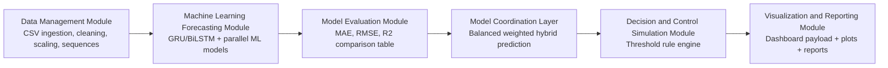

# Hybrid AI Microclimate Forecasting Architecture

```mermaid
flowchart LR
    A[Data Management Module
CSV ingestion, cleaning, scaling, sequences]
    B[Machine Learning Forecasting Module
GRU/BiLSTM + parallel ML models]
    C[Model Evaluation Module
MAE, RMSE, R2 comparison table]
    D[Model Coordination Layer
Balanced weighted hybrid prediction]
    E[Decision and Control Simulation Module
Threshold rule engine]
    F[Visualization and Reporting Module
Dashboard payload + plots + reports]

    A --> B --> C --> D --> E --> F
```

This architecture implements a complete microclimate forecasting pipeline.
