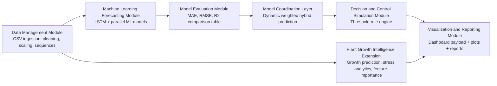

# Hybrid AI Microclimate Forecasting Architecture

```mermaid
flowchart LR
    A[Data Management Module\nCSV ingestion, cleaning, scaling, sequences]
    B[Machine Learning Forecasting Module\nLSTM + parallel ML models]
    C[Model Evaluation Module\nMAE, RMSE, R2 comparison table]
    D[Model Coordination Layer\nDynamic weighted hybrid prediction]
    E[Decision and Control Simulation Module\nThreshold rule engine]
    F[Visualization and Reporting Module\nDashboard payload + plots + reports]
    G[Plant Growth Intelligence Extension\nGrowth prediction, stress analytics, feature importance]

    A --> B --> C --> D --> E --> F
    A --> G --> F
```

This extends the existing architecture without removing any original module.
